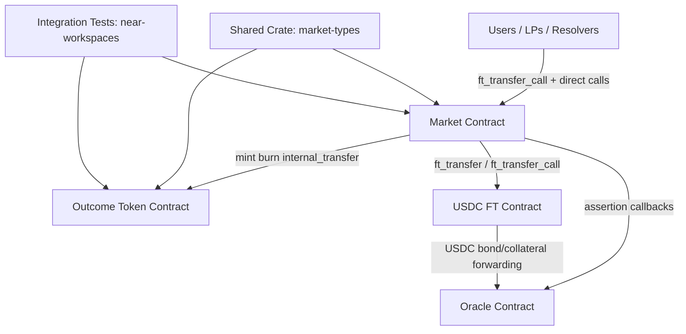
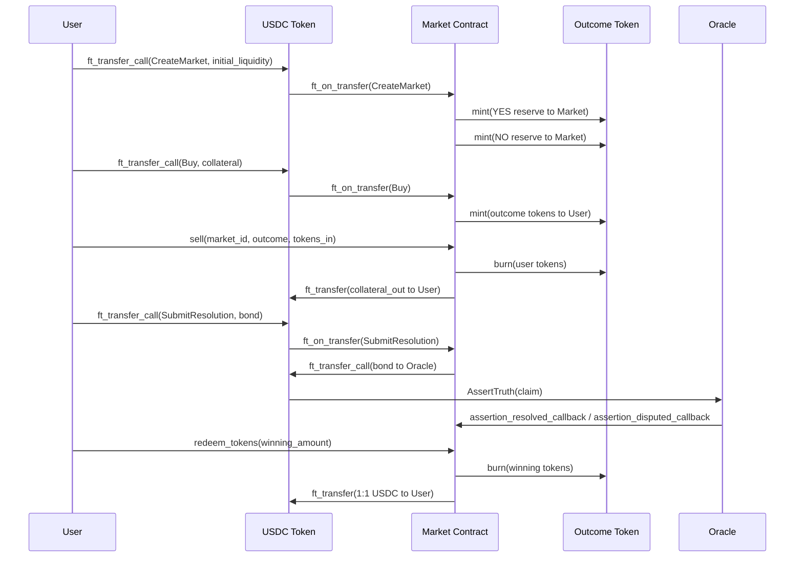

# Nest Markets

## Idea

`nest-markets` is a NEAR-based binary prediction market system.

Each market asks a yes/no question, takes USDC as collateral, and allows users to:

- create markets with initial liquidity
- buy/sell YES or NO exposure through an AMM
- provide/remove liquidity and earn fees
- resolve outcomes through an oracle flow
- redeem winning tokens 1:1 for USDC after settlement

The design separates market logic (AMM + lifecycle) from outcome token accounting.

## Architecture

Workspace members:

- `market`:
  - Main protocol contract.
  - Handles market creation, AMM pricing/trading, LP accounting, resolution, and redemption.
  - Accepts USDC via `ft_transfer_call` and routes actions through `ft_on_transfer`.
- `outcome-token`:
  - Ledger for per-market outcome balances.
  - Stores balances/supply keyed by `(market_id, outcome, account_id)`.
  - Only callable by the market contract for `mint`, `burn`, and `internal_transfer`.
- `crates/market-types`:
  - Shared types/constants used by contracts/tests.
  - Includes `Market`, `Outcome`, `MarketStatus`, `MarketFtMsg`, config/view structs.
- `mock-ft`:
  - Minimal NEP-141 fungible token (mock USDC, 6 decimals) used in integration tests.
  - Has owner-only `mint` for test setup.
- `integration-tests`:
  - Near Workspaces sandbox harness with 7 end-to-end tests covering market creation, buy/sell, liquidity, price movement, and minimum liquidity enforcement.

Core external dependencies:

- USDC FT contract (`usdc_token`) for collateral movement.
- Oracle contract (`oracle`) for assertion/dispute/settlement callbacks.

## Architecture Diagram



## Contract Flow

### 1. Market Creation

1. User sends USDC to market contract with `MarketFtMsg::CreateMarket` via `ft_transfer_call`.
2. `market::ft_on_transfer` validates token and routes to `internal_create_market`.
3. Market is created with:
   - status `Open`
   - 50/50 initial YES/NO reserves
   - LP shares assigned to creator
4. Market contract mints YES and NO reserve tokens to itself on `outcome-token`.

### 2. Trading (Buy/Sell)

Buy path:

1. User sends USDC with `MarketFtMsg::Buy`.
2. Contract deducts fee, updates pool state using constant-product style math.
3. Contract mints purchased outcome tokens to buyer on `outcome-token`.

Sell path:

1. User calls `sell(market_id, outcome, tokens_in, min_collateral_out)`.
2. Contract updates reserves, computes collateral out minus fee.
3. Contract burns seller outcome tokens, then transfers USDC back.

### 3. Liquidity Management

Add liquidity path:

1. User sends USDC with `MarketFtMsg::AddLiquidity`.
2. Contract computes LP shares proportional to pool state.
3. Reserves/collateral/LP totals are updated.
4. Matching reserve tokens are minted to market contract.

Remove liquidity path:

1. User calls `remove_liquidity(market_id, shares)`.
2. Contract withdraws proportional collateral and reserves.
3. Contract burns reserve tokens from itself.
4. Contract transfers withdrawn USDC to provider.

### 4. Resolution + Settlement

1. After `resolution_time_ns`, resolver sends USDC bond via `MarketFtMsg::SubmitResolution`.
2. Contract sets market to `Resolving`, hashes claim, forwards bond to oracle using `ft_transfer_call`.
3. Oracle callback:
   - `assertion_resolved_callback(asserted_truthfully=true)` -> market `Settled` with asserted outcome.
   - `assertion_resolved_callback(asserted_truthfully=false)` -> market `Closed` (can be re-resolved).
   - `assertion_disputed_callback` -> market `Disputed`.

### 5. Redemption

1. After settlement, holders of winning tokens call `redeem_tokens`.
2. Contract burns winning tokens from redeemer.
3. On successful burn callback, contract transfers equal USDC to redeemer.

## Flow Diagram



## Suggested Reading Order (What to Look Into First)

1. `crates/market-types/src/lib.rs`:
   - Understand data model, statuses, constants, and `MarketFtMsg`.
2. `market/src/lib.rs`:
   - Entry points, initialization, and `ft_on_transfer` action router.
3. `market/src/amm.rs`:
   - Buy/sell math, liquidity add/remove logic, fee handling.
4. `outcome-token/src/lib.rs`:
   - Token mint/burn authorization and balance/supply indexing.
5. `market/src/resolution.rs`:
   - Oracle assertion flow, dispute/settlement callbacks.
6. `market/src/redemption.rs`:
   - Post-settlement redemption flow and burn callback.
7. `market/src/views.rs`:
   - Read APIs used by indexers/UI.
8. `market/src/events.rs`:
   - Event schema emitted for indexing and analytics.
9. `integration-tests/tests/e2e_market_flow.rs`:
   - Deployment/init reference; extend for full lifecycle tests.

## Contract API Reference

### Market Contract

#### Write Methods (via `ft_transfer_call` on USDC contract)

All write actions are routed through `ft_transfer_call` on the USDC token contract. The `receiver_id` is the market contract, and the `msg` field is a JSON-encoded `MarketFtMsg`:

**Create Market**
```json
{
  "action": "CreateMarket",
  "question": "Will ETH hit $10k by end of 2026?",
  "description": "Resolves YES if ...",
  "resolution_time_ns": "1735689600000000000"
}
```
- `amount`: initial liquidity in USDC (min 10 USDC = `"10000000"`)
- `resolution_time_ns`: nanosecond timestamp (string-encoded u64)

**Buy Outcome Tokens**
```json
{
  "action": "Buy",
  "market_id": 0,
  "outcome": "Yes",
  "min_tokens_out": "900000"
}
```
- `amount`: USDC collateral to spend
- `outcome`: `"Yes"` or `"No"`
- `min_tokens_out`: slippage protection (string-encoded u128)

**Add Liquidity**
```json
{
  "action": "AddLiquidity",
  "market_id": 0
}
```
- `amount`: USDC to add as liquidity

**Submit Resolution**
```json
{
  "action": "SubmitResolution",
  "market_id": 0,
  "outcome": "Yes"
}
```
- `amount`: USDC bond forwarded to oracle
- Only callable after `resolution_time_ns` has passed

#### Write Methods (direct calls)

**`sell`** — Sell outcome tokens back to the pool for USDC
```
near call <market> sell '{"market_id": 0, "outcome": "Yes", "tokens_in": "1000000", "min_collateral_out": "400000"}' --accountId <user>
```
| Param | Type | Description |
|---|---|---|
| `market_id` | `u64` | Market ID |
| `outcome` | `"Yes" \| "No"` | Which token to sell |
| `tokens_in` | `U128` | Amount of outcome tokens to sell |
| `min_collateral_out` | `U128` | Minimum USDC to receive (slippage) |

**`remove_liquidity`** — Withdraw LP position
```
near call <market> remove_liquidity '{"market_id": 0, "shares": "10000000"}' --accountId <user>
```
| Param | Type | Description |
|---|---|---|
| `market_id` | `u64` | Market ID |
| `shares` | `U128` | LP shares to burn |

**`redeem_tokens`** — Redeem winning tokens for USDC 1:1 after settlement
```
near call <market> redeem_tokens '{"market_id": 0, "amount": "1000000"}' --accountId <user>
```
| Param | Type | Description |
|---|---|---|
| `market_id` | `u64` | Market ID (must be `Settled`) |
| `amount` | `U128` | Winning outcome tokens to redeem |

#### View Methods (free, no gas)

**`get_market`** — Returns full market state
```
near view <market> get_market '{"market_id": 0}'
```
Returns `MarketView`:
```json
{
  "id": "0",
  "question": "Will ETH hit $10k?",
  "description": "...",
  "creator": "alice.testnet",
  "resolution_time_ns": "1735689600000000000",
  "status": "Open",
  "outcome": null,
  "yes_reserve": "5000000",
  "no_reserve": "5000000",
  "yes_price": "500000",
  "no_price": "500000",
  "total_lp_shares": "10000000",
  "total_collateral": "10000000",
  "fee_bps": 200,
  "accrued_fees": "0"
}
```
- Prices are scaled to 1e6 (`500000` = 0.50 = 50%)
- Status: `"Open"`, `"Closed"`, `"Resolving"`, `"Disputed"`, `"Settled"`

**`get_market_count`** — Total number of markets created
```
near view <market> get_market_count
```
Returns `u64`.

**`get_prices`** — Current YES/NO prices
```
near view <market> get_prices '{"market_id": 0}'
```
Returns `[U128, U128]` — `[yes_price, no_price]`, scaled to 1e6.

**`estimate_buy`** — Preview tokens received for a given collateral amount
```
near view <market> estimate_buy '{"market_id": 0, "outcome": "Yes", "collateral_in": "1000000"}'
```
Returns `U128` — estimated tokens out (after fees).

**`get_lp_shares`** — LP share balance for an account
```
near view <market> get_lp_shares '{"market_id": 0, "account_id": "alice.testnet"}'
```
Returns `U128`.

**`get_config`** — Protocol configuration
```
near view <market> get_config
```
Returns `ConfigView`:
```json
{
  "owner": "owner.testnet",
  "usdc_token": "nusd-1.testnet",
  "outcome_token": "outcome-token-2.testnet",
  "oracle": "nest-oracle-7.testnet",
  "market_count": "5",
  "default_fee_bps": 200
}
```

### Outcome Token Contract

All mutating methods are restricted to the market contract only. Frontend reads use the view methods.

#### View Methods

**`balance_of`** — Token balance for a user in a specific market/outcome
```
near view <outcome-token> balance_of '{"market_id": 0, "outcome": "Yes", "account_id": "alice.testnet"}'
```
Returns `U128`.

**`total_supply`** — Total minted tokens for a market/outcome
```
near view <outcome-token> total_supply '{"market_id": 0, "outcome": "Yes"}'
```
Returns `U128`.

---

## Build & Test

Requires Rust 1.86.0 (pinned in `rust-toolchain.toml`) and [`cargo-near`](https://github.com/near/cargo-near).

```bash
# Build WASM for all contracts
for contract in outcome-token market mock-ft; do
    (cd "$contract" && cargo near build non-reproducible-wasm --no-abi)
done

# Run unit tests
cargo test -p outcome-token

# Run integration tests (builds WASM first)
cargo test -p market-integration-tests
```

See [scripts/deploy.sh](scripts/deploy.sh) for testnet deployment.

## Practical Notes

- USDC precision is 6 decimals (`USDC_ONE = 1_000_000`).
- Minimum initial liquidity is enforced (`MIN_INITIAL_LIQUIDITY`).
- All arithmetic uses `u128` — sufficient for USDC amounts up to ~340B per side.
